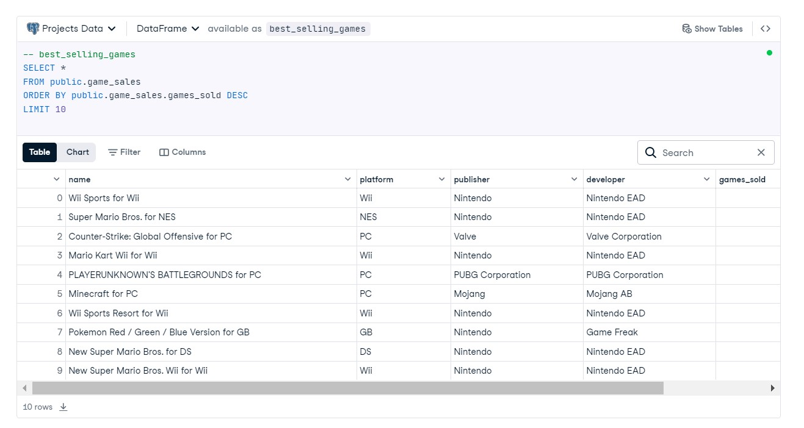
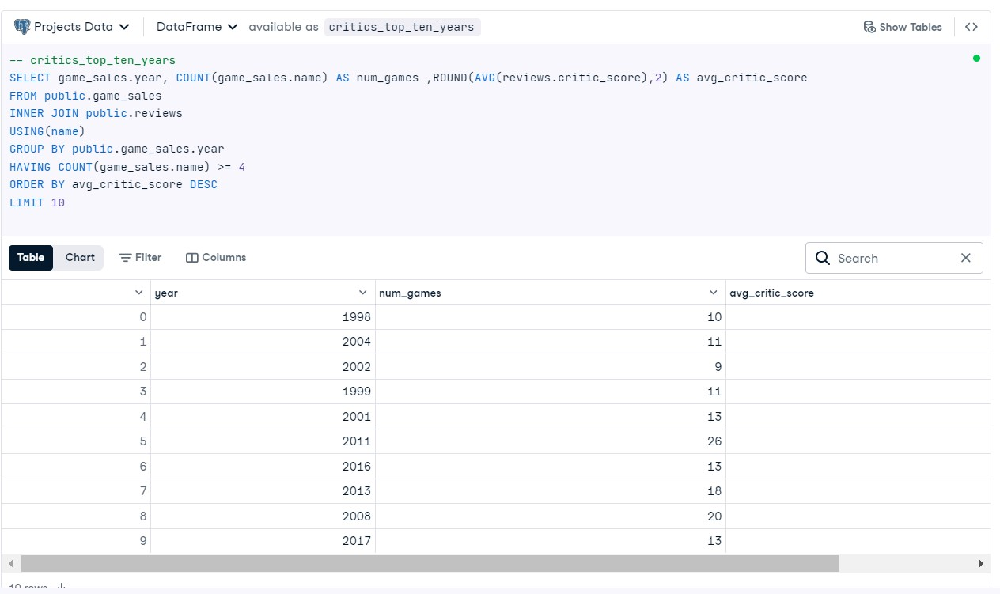
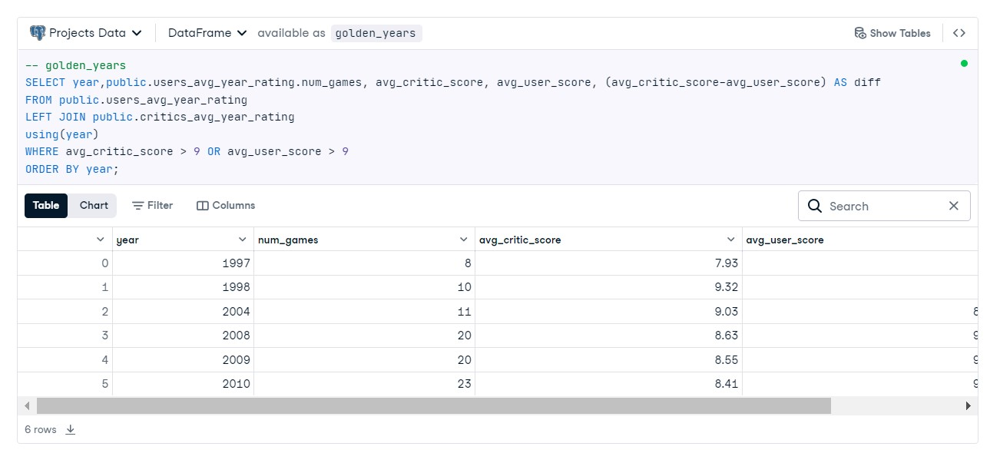

# The-Golden-Era-of-Video-Games

Exploratory data analysis (EDA) of International debt statistics using SQL.
## INTRODUCTION
The global video game industry is a major player in entertainment, with projections suggesting it will exceed $300 billion in value by 2027. With immense revenue at stake, game publishers are constantly striving to produce blockbuster titles that capture both critical acclaim and consumer enthusiasm. But what makes a game successful, and has the industry reached its peak in terms of quality and popularity?

This project delves into video game sales and review data to explore key questions about the evolution of the industry. By analyzing the top 400 video games released since 1977, this study seeks to answer three critical questions:

1.Which Games Have Achieved the Greatest Commercial Success?
The project will identify the top ten best-selling games by examining sales data, providing insights into the commercial giants of the industry.

2. What Were the Highest-Rated Years According to Critics?
By exploring critic scores, we aim to uncover the ten years with the highest average ratings, considering only years with at least four game releases to ensure a representative sample.

3. When Did Critics and Users Agree on Game Quality?
Lastly, the project investigates the years when critics and users collectively deemed games to be highly rated. This will highlight the years where the average scores from both groups exceeded 9, revealing potential "golden years" of gaming consensus.

These questions will be answered using a combination of SQL techniques, including joining datasets, filtering, grouping, and ordering results. Through this exploration, the project aims to provide a nuanced perspective on whether the gaming industry's evolution has lived up to expectations—and to pinpoint the standout moments in gaming history.
## ANALYSIS
### 1. Identifying the Top Ten Best-Selling Games
#### Methodology:
To determine the most commercially successful games, I analyzed the game_sales table, which includes data on game names, platforms, publishers, developers, and sales figures. The data was sorted by the number of copies sold to highlight the games with the highest sales. Limiting the output to the top ten entries allowed for a focused view on the industry’s blockbuster titles, revealing which games achieved exceptional commercial success and resonated most with consumers.

### 2. Finding the Top Ten Years by Average Critic Score
#### Methodology:
To explore the years that received the highest critical acclaim, I performed a full join between the game_sales and reviews tables. This approach enabled a comprehensive analysis of critic scores in relation to sales data, grouping the results by year and calculating the average critic score for each. By applying a filter to include only those years with a minimum of four game releases, I ensured that the sample size for each year was robust enough to be meaningful. Sorting the results by average critic score then highlighted the top ten years with the highest levels of critical appreciation.

### 3. Identifying Years of Consensus Between Critics and Users
#### Methodology:
To identify years when both critics and users highly rated games, I analyzed the yearly average scores from the users_avg_year_rating and critics_avg_year_rating tables. By focusing on years where either the average critic score or average user score was above 9, I pinpointed the years considered exceptional by either group. I then calculated the difference between these scores to understand the degree of consensus between users and critics. Sorting the data by year provided a chronological view of these “golden years,” offering insights into periods when the gaming experience was celebrated by both reviewers and players alike.

This methodology leverages data joins, grouping, and filtering to uncover meaningful trends and insights, providing a detailed look into the gaming industry’s top-selling titles, critically acclaimed years, and years marked by high user and critic consensus.

## CONCLUSION
This project provided insights into the video game industry’s top-selling titles, highest-rated years, and periods of shared appreciation between critics and players. By identifying commercially successful games, we highlighted titles that left a significant mark on the market. Analyzing critic scores pointed to possible "golden ages" in gaming, where quality and innovation were at their peak.

Exploring consensus between critics and users revealed years of broad appreciation, offering a glimpse into what resonates with diverse audiences. These findings underscore the varied factors that define a game’s success, offering valuable lessons for the future of game development.

## Project Notebook
You can view the complete project notebook on DataCamp Datalab by [Clicking here](https://www.datacamp.com/datalab/w/dabf40a0-3774-41c5-9dc6-fdacf9dad5ae/edit)

